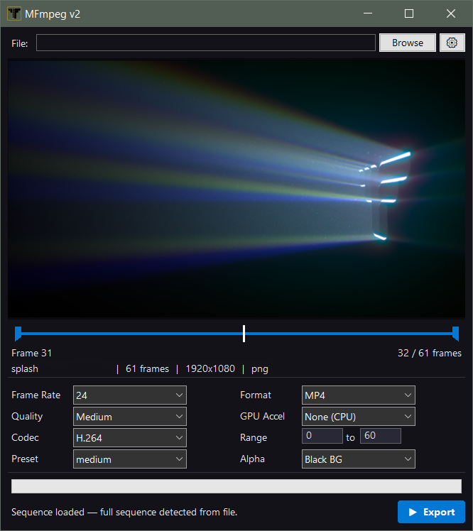

# MFmpeg v2

**Image sequence to video converter for Windows.**

Right-click any image in a sequence and export as MP4, MOV, or WebM. GPU accelerated. Alpha channel support.

## Download

| | Description |
|---|---|
| **[MFmpegV2_Setup_2.0.0.exe](MFmpegV2_Setup_2.0.0.exe)** | Installer — sets up context menus and optionally bundles FFmpeg |
| **[MFmpeg_v2_Portable.zip](MFmpeg_v2_Portable.zip)** | Portable — standalone, no installation required (requires [FFmpeg](https://www.gyan.dev/ffmpeg/builds/)) |

## Features

- Right-click any image file to open its sequence in MFmpeg
- Smart sequence detection from a single file or multi-select
- Export to MP4 (H.264/H.265), MOV (ProRes), or WebM (VP9)
- GPU acceleration (NVIDIA NVENC, AMD AMF, Intel QSV)
- Alpha channel support (ignore, black/white BG, preserve)
- Interactive timeline with draggable in/out markers
- Frame range selection with keyboard shortcuts
- Multiple themes (Dark, Light, Retro, Solarized, Nord)
- Settings persistence across sessions

## Keyboard Shortcuts

| Key | Action |
|-----|--------|
| `I` | Set in-point |
| `O` | Set out-point |
| `←` `→` | Step one frame |
| `Home` `End` | Jump to first / last frame |

## Requirements

- Windows 10+ (x64)
- [FFmpeg](https://www.gyan.dev/ffmpeg/builds/) (bundled with installer, or place in same folder for portable)

## Screenshot

## License

[MIT](LICENSE) — © 2026 FriskCinema

## Website

[mfmpeg.friskcinema.com](https://mfmpeg.friskcinema.com)
